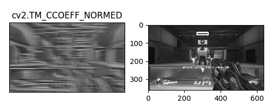

# python-opencv
opencv template matching을 활용한 오버워치 에임핵

</img>
##### <그림1. 스크린샷을 통한 이미지 추출>

</img>
##### <그림2. 이미지에서 캐릭터 좌표를 얻기 위한 기준점으로 피통사용>

</img>
##### <그림3. opencv에서 제공하는 template matching 을 사용하여 피통을 검색한 결과>
