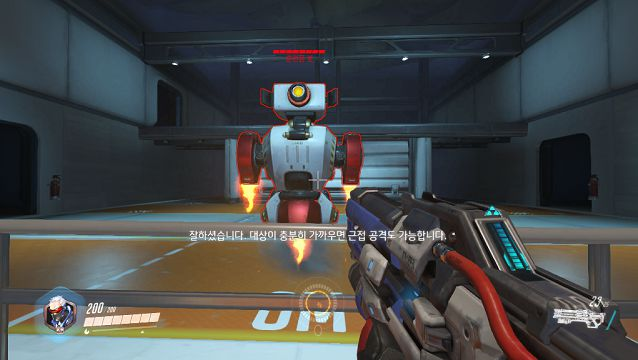

# python-opencv
opencv template matching을 활용한 오버워치 에임핵

### 개발환경 세팅 (Mac)
<code>git clone https://github.com/h4ppyy/python-opencv</code>  
<code>cd python-opencv</code>   
<code>. venv/bin/activate</code>  
<code>pip install requirements.txt</code>   

### matplotlib bugfix (Mac)
<code>echo "backend: TkAgg" >> ~/.matplotlib/matplotlibrc</code>

### 모듈 실행 (Mac)
<code>python opencv.py</code>   
<code>python screen.py</code>   

</img>
##### <그림1. 스크린샷을 통한 이미지 추출>

</img>
##### <그림2. 이미지에서 캐릭터 좌표를 얻기 위한 기준점으로 피통사용>

</img>
##### <그림3. opencv에서 제공하는 template matching 을 사용하여 피통을 검색한 결과>
